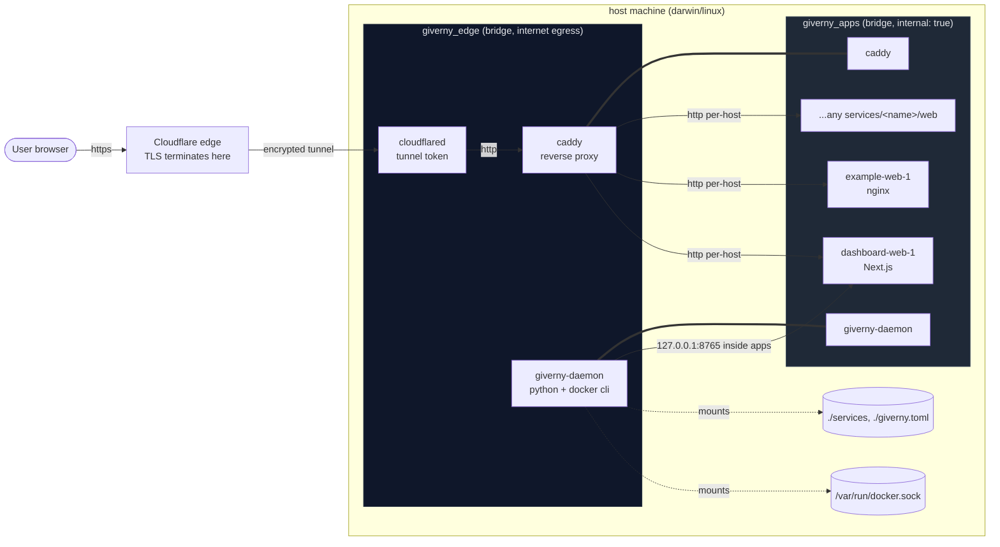
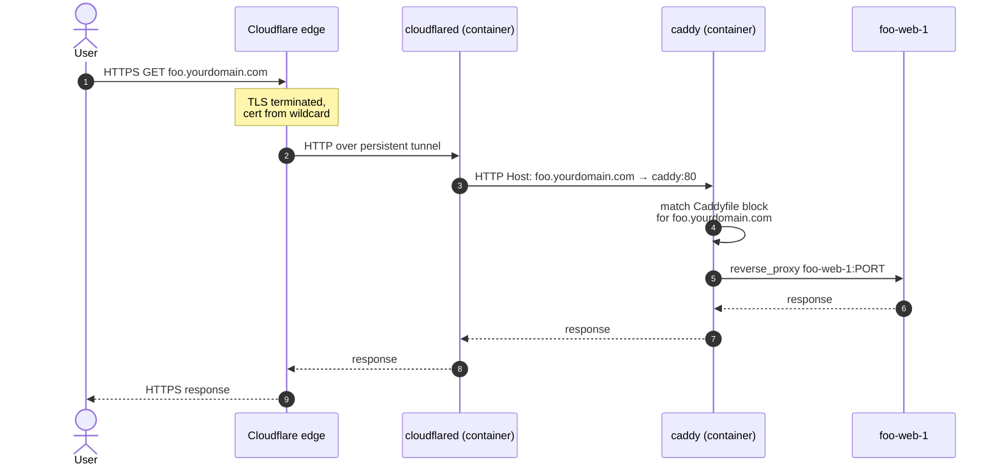
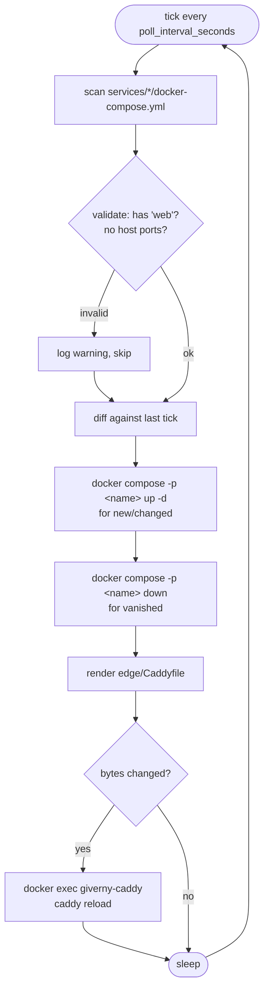
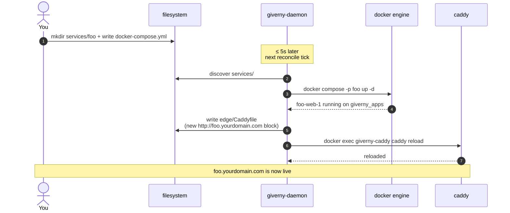
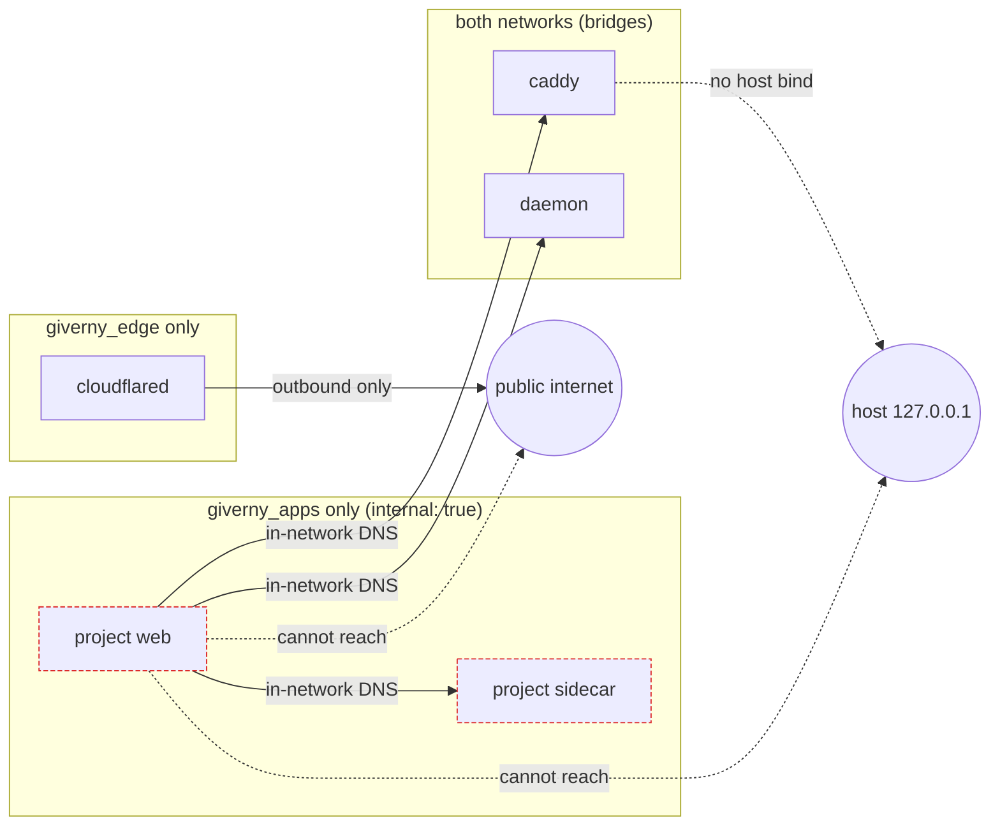
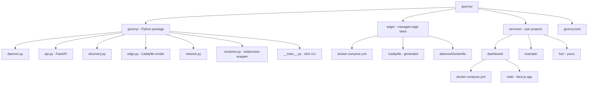
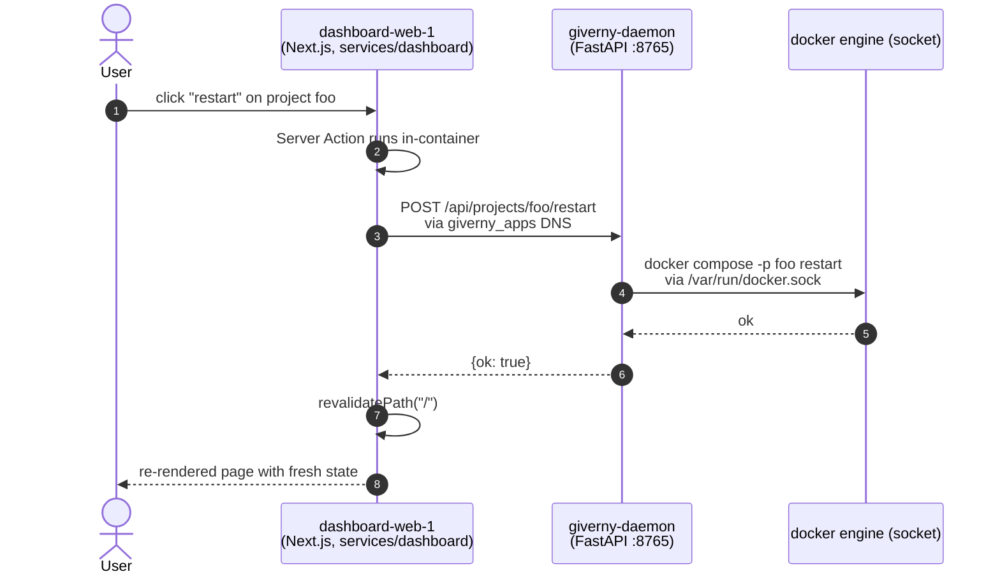

# giverny — architecture

## Components and networks

`caddy` and `giverny-daemon` are dual-homed — shown twice just so the diagram is readable. Only they and `cloudflared` ever have internet egress; project containers live on `giverny_apps` (`internal: true`) and cannot reach the host or the public internet.

## Request path for `foo.yourdomain.com`

DNS resolution is free: the wildcard public hostname on the tunnel creates a `*.yourdomain.com` CNAME to the tunnel, so any new subdomain resolves with zero additional config.

## Daemon reconcile loop

The filesystem is the single source of truth — no state file, no database. Killing and restarting the daemon is a no-op if nothing has changed.

## Adding a new project

## Isolation model

- **cloudflared** is the only component that initiates outbound connections — it opens an outbound tunnel; no ports are ever exposed on the host.
- **caddy** and **daemon** bridge `giverny_edge` ↔ `giverny_apps` so reverse proxying and container orchestration work, but they do not publish host ports either.
- **project containers** on `giverny_apps` (`internal: true`) cannot reach the host or the internet. They can only talk to siblings and to caddy/daemon by DNS name inside the network.

## File layout

## Data flow: dashboard action

The dashboard never touches the docker socket. It only speaks HTTP to the daemon, which is the single component authorised to orchestrate containers.
